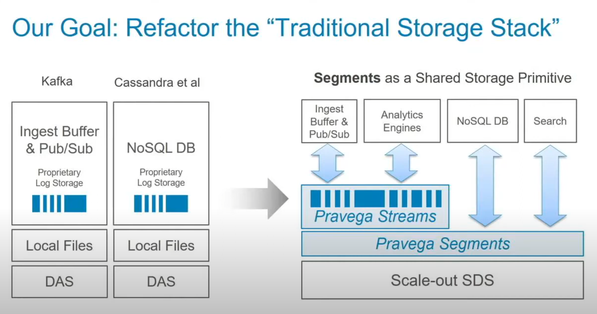
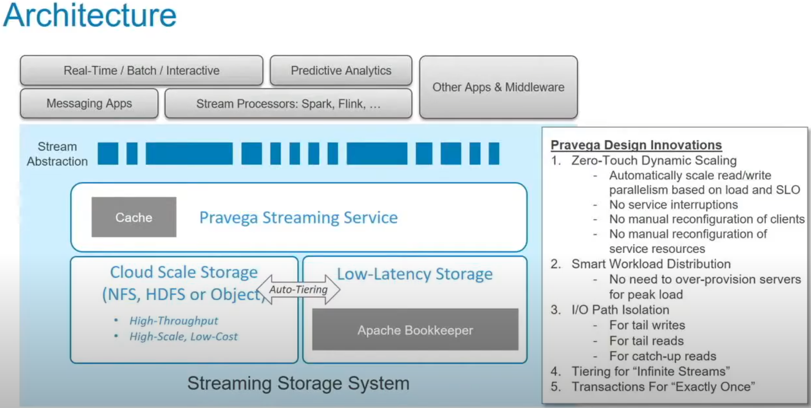
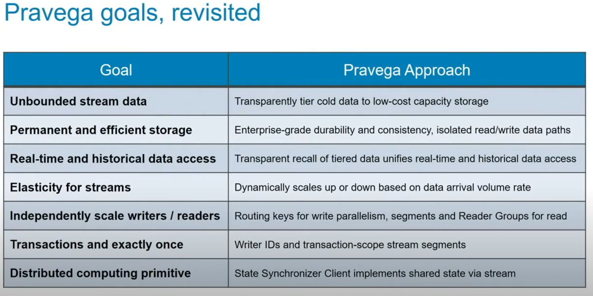
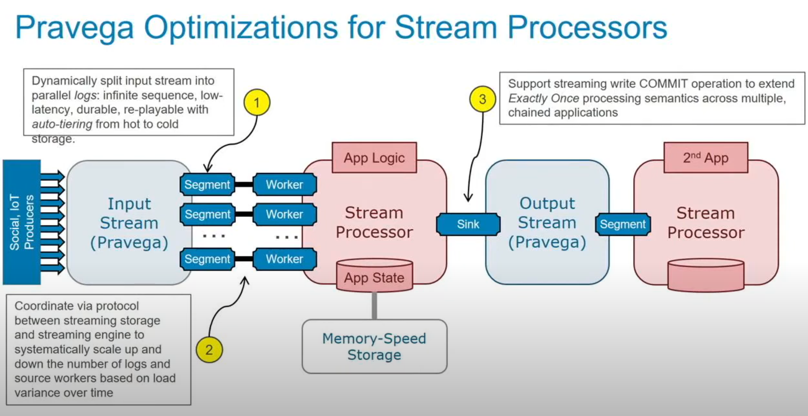
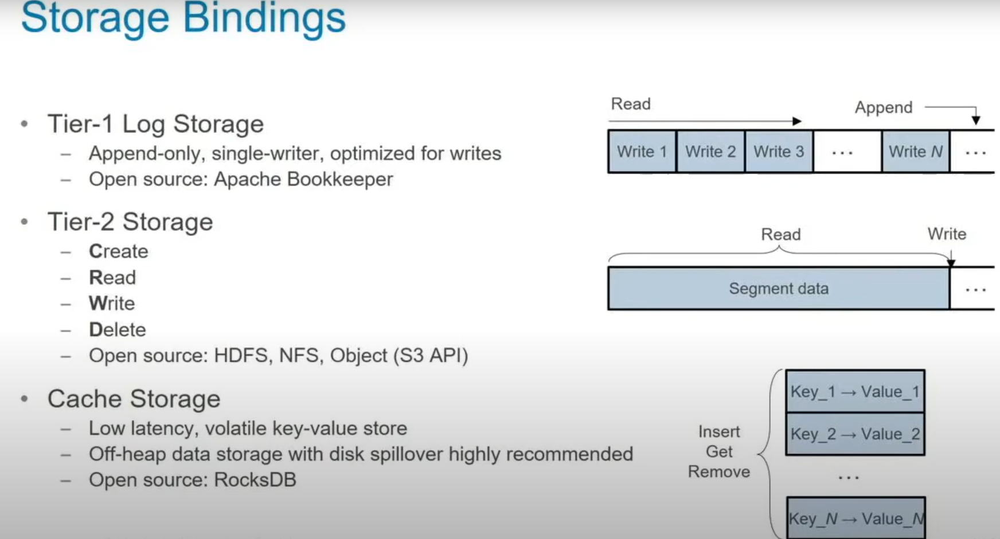
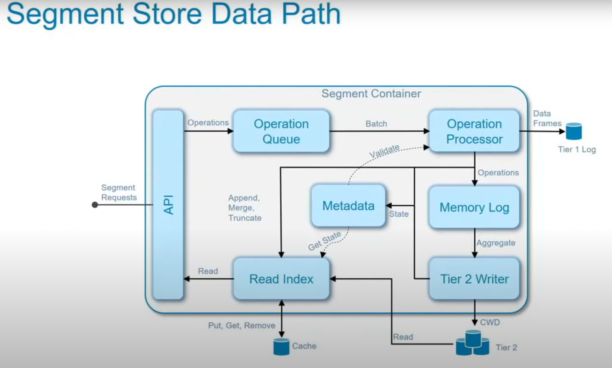

- Pravega is a storage design for data stream.
- The idea was to use the segments as a Shared Storage Primitive

# Segment
    - Base storage primitive is a segment
    - A segment is an append-only sequence of bytes
    - writes durably persisted before acknowledgement
## Segment Sealing
    - A segment may be sealed
    - A sealed segment cannot be appended to any more
    - Basis for advanced features such as stream elasticity and transactions

# Stream
    - A stream is composed of one or more segments
    - Routing key determines the target segment for a stream write
    - Write order preserved by routing key; consistent tail and catch up reads
    - There are no architectural limits on the number of streams or segments
    - Each segment can live in a different server
    - System is not limited in any way by the capacity of a single server

## Stream Elasticity
    - Data arrival volume increases - more parallelism needed!
    1. Seal the original segment
    2. Replace with two new ones
    3. New segments may be distributed throughout the cluster balancing load
    * key ranges are dynamically assigned to segments
    * elasticity - dynamic scale up or down based on data volume rate

# Unbounded Streams
    - Segments are automatically tiered to long term storage
    - Data in tiered segments is transparently accessible for catch-up reads
    - Preserves stream abstraction while lowering storage costs for older data

** Most part of the time the data is searching from the cache Tier 1

# Pravega Client
# Transactions
## Guarantees
    - Durability guaranteed
    - Events are always "whole" (atomic, no partial writes)
    - In order delivery per key
    - Exactly once delivery
## Non-Guarantees
    - order across routing keys
    - A read following a write may not immediately receive the event

## Comments
Tier 1 for ingestion (log store)
Tier 2 for long term storage(file/object)

# Documentation

- https://www.youtube.com/watch?v=-O7rXYAJv08&t=1628s&ab_channel=MicrosoftResearch <continue here
- https://cncf.pravega.io/docs/latest/pravega-concepts/
- https://kmgowda.github.io/SBK/docs/kafka-pravega.pdf