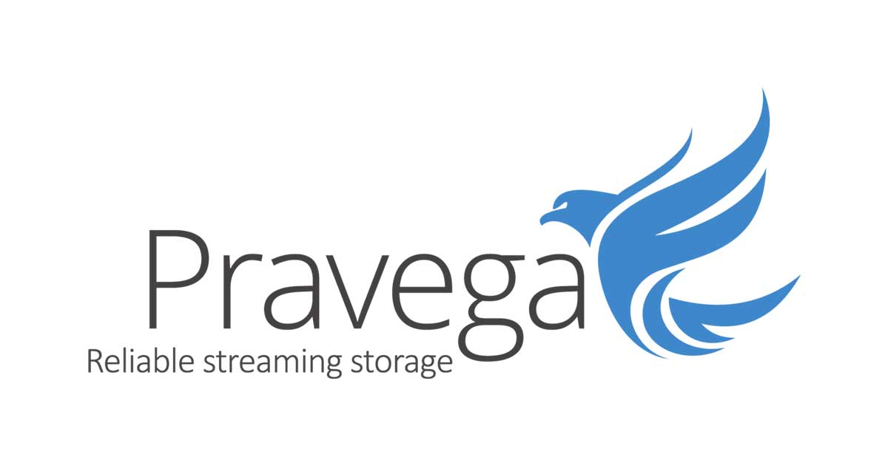
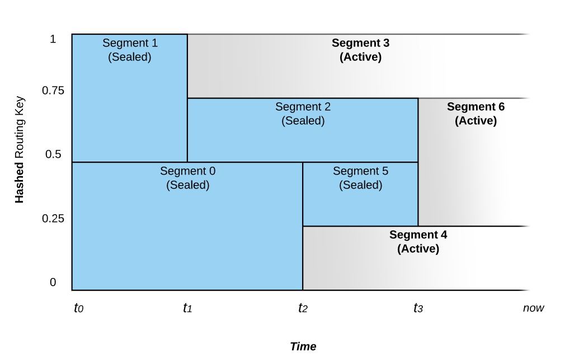
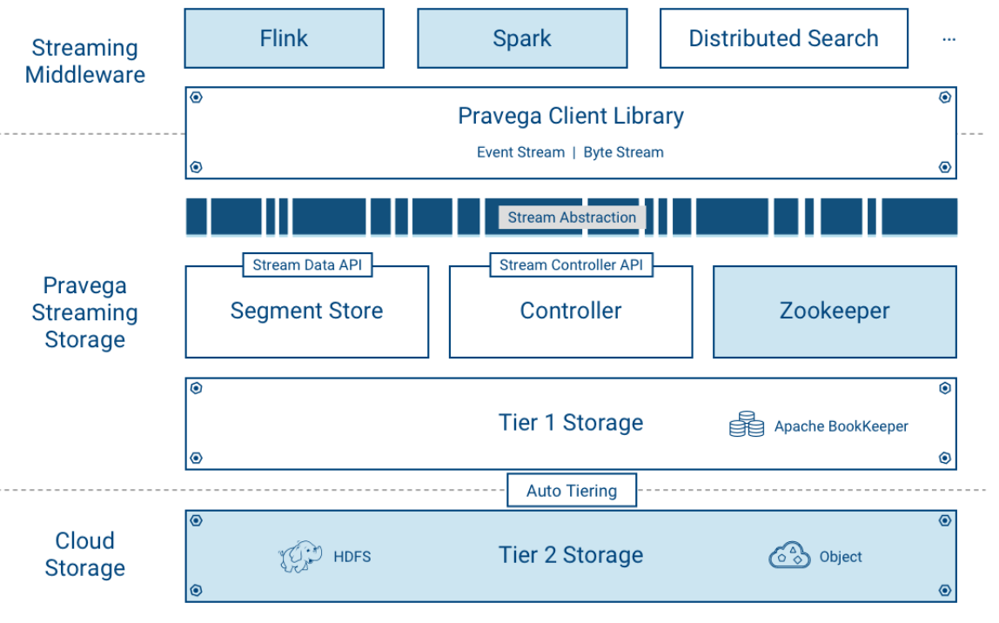

# What is Pravega?
Pravega is an open source scalable and high-performance storage system designed to handle large volumes of streaming data. 
It allows you to ingest, process, and store continuous streams of data efficiently and reliably.

# Why Pravega?
Pravega rapidly ingests data into durable storage. It supports a large variety of application use cases:

- Stream processing with frameworks like Flink.
- Publish/subscribe messaging.
- NoSQL databases like Time Series Database (TSDB).
- Workflow engines.
- Event-oriented applications, etc. 

# Some Pravega Key Features
 - Auto Scaling: 
Pravega automatically scales data streams by adjusting the number of stream segments based on data ingestion rates. Streams can grow by splitting segments or shrink by merging segments, maintaining efficient data ingestion, storage, and processing.

 - Write and Read Efficiency: 
Pravega supports low-latency writes and efficient read operations, using two types of storage: Tier 1 for tail reads and writes, and Tier 2 for historical data, ensuring high throughput without impacting performance.

 - Unlimited Retention, Storage Efficiency, Transaction Support, Exactly Once Semantics...

# Pravega Streams
    - A stream is composed of one or more segments
    - A segment is an append-only sequence of bytes

# Architecture

 - Tier 1: It provides short term, low-latency data storage, guaranteeing the durability of data written to Streams. Pravega uses Apache Bookkeeper to implement Tier 1 Storage
 - Tier 2: It provides long term storage for Stream data, that provides a highly-scalable, high-throughput cost-effective storage.

Storage tiering allows Pravega to achieve a sweet spot in the latency vs throughput trade-off. This makes Pravega an ideal storage substrate for serving data to both real-time and batch (analytics) applications.

